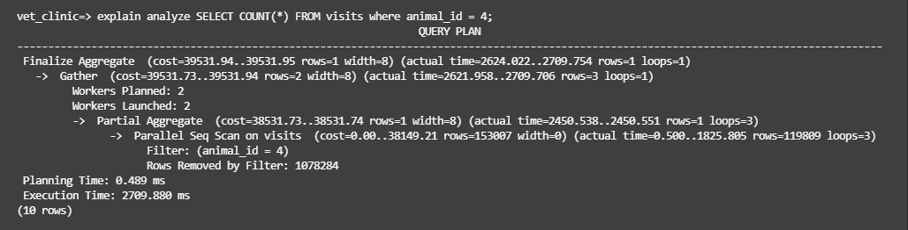
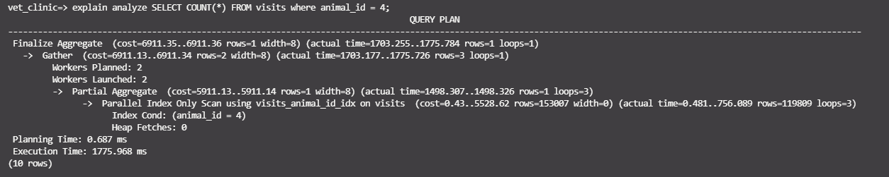
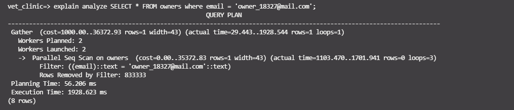

# vet-clinic-db

## Table of Contents

- [About Project](#about-project)
- [Built With](#built-with)
- [Prerequisites](#prerequisites)
- [Getting Started](#getting-started)
- [Contributing](#contributing)
- [Author](#author)
- [Acknowledgements](#acknowledgements)
- [Show your support](#show-your-support)

## About Project

This project is built as a practice for optimizing search queries in a populated database. We start with a regular database, then fill it with data to slow down the query times, and then use optimization techniques to achieve faster query calls compared to the unoptimized ones. Using this project, you can replicate the database to see how you can also implement your own solutions to the problems, or see how your solution compares to ours.

The following are screenshot displaying the before and after results on analysing the SQL data.

## Query ONE

`explain analyze SELECT COUNT(*) FROM visits where animal_id = 4;`

### BEFORE



### AFTER



## Query TWO

`explain analyze SELECT * FROM visits where vet_id = 2;`

### BEFORE


### AFTER


## Query THREE

`explain analyze SELECT * FROM owners where email = 'owner_18327@mail.com';`

### BEFORE



### AFTER


## Built With

- PostgreSQL

## Prerequisites

- Ensure you have PostgreSQL DBMS installed

```bash
sudo apt update && sudo apt install postgresql postgresql-contrib
```

## Getting Started

- Clone this repo <https://github.com/enkog/vet-clinic-db>

  ```bash
  git clone https://github.com/enkog/vet-clinic-db.git
  ```

- Navigate to vet-clinic folder/directory

  ```bash
  cd vet-clinic
  ```

- Create the `vet_clinic` database

- If you need help working with Postgres follow this **_[GUIDE](https://www.digitalocean.com/community/tutorials/how-to-install-postgresql-on-ubuntu-20-04-quickstart)_**

- **Creating Tables**

```bash
psql vet_clinic < schema.sql
```

- **Add data to Tables**

```bash
psql vet_clinic < data.sql
```

- **Run the Queries**

```bash
psql vet_clinic < queries.sql
```

## Contributing

Contributions, issues, and feature requests are welcome!

Feel free to check the [issues page](https://github.com/enkog/vet-clinic-db/issues)

1. Fork the Project
2. Create your Feature Branch (`git checkout -b feature/newFeature`)
3. Commit your Changes (`git commit -m 'Add some newFeature'`)
4. Push to the Branch (`git push -u origin feature/newFeature`)
5. Open a Pull Request

## Authors

👤 **Oguadinma Nkiruka Ngozika**

- Github: [@enkog](https://github.com/enkog)
- Linkedin: [@enkog](https://www.linkedin.com/in/enkog/)

👤 **Lameck Otieno**

- GitHub: [@githubhandle](https://github.com/Lameck1)
- Twitter: [@twitterhandle](https://twitter.com/lameck721)
- LinkedIn: [LinkedIn](https://www.linkedin.com/in/lameck-odhiambo-642b7077/)
- Portfolio: [Portfolio](https://lameck.me)

## Acknowledgements

- [Postgres ORG](https://www.postgresql.org/) for the documentation and guides on getting started with PostgreSQL DBMS.

## Show your support

Give a ⭐️ if you like this project!